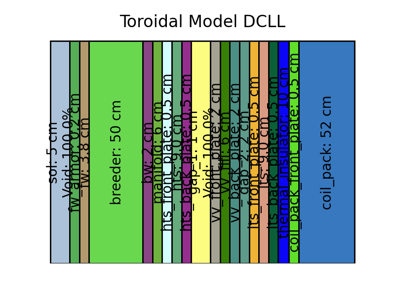

## Workflow for using `radial_build_tools` and `fusion-materials-db`
This process uses the [`fusion-materials-db`](https://github.com/svalinn/fusion-material-db) to create an OpenMC materials object that defines the composition of materials used in an OpenMC simulation. This is used with [`radial_build_tools`](https://github.com/svalinn/radial_build_tools) to generate a model for OpenMC (geometry and materials). The result is a model XML file and a visual of the geometry, an example is shown below.



Steps
1. Write a script to create materials object (Examples: [`dcll_materials.py`](https://github.com/svalinn/radial_build_tools/tree/main/examples/dcll_hcpb_examples/dcll_radial_build_example/dcll_materials.py) [`HCPB_Mix_Materials.py`](https://github.com/svalinn/radial_build_tools/tree/main/examples/dcll_hcpb_examples/hcpb_radial_build_example/HCPB_Mix_Materials.py))
    1. Import [`material_db_tools.py`](https://github.com/svalinn/fusion-material-db/blob/main/material-db-tools/material_db_tools.py)
    2. Create a function to make a dictionary with each entry of the form:     
    ```
    "<material_name>": {
        "composition": {"<material_component>": <fraction>, ...},
        "citation": "<citation>",
    },
    ```
    adding `density_factor` when needed
    
    More detail given in [`material_db_tools.py`](https://github.com/svalinn/fusion-material-db/blob/main/material-db-tools/material_db_tools.py)

    3. Create a function that does the following:
        
        1. Opens [`PureFusionMaterials_libv1.json`](https://github.com/svalinn/fusion-material-db/blob/main/db-outputs/PureFusionMaterials_libv1.json) 
        
        2. Calls `mix_by_volume()` from [`material_db_tools.py`](https://github.com/svalinn/fusion-material-db/blob/main/material-db-tools/material_db_tools.py) to create a PyNE material library
    4. Create a `main()` function to call the helper functions and export the materials library to XML file
2. Create toroidal model (Examples: [`dcll_radial_build.py`](https://github.com/svalinn/radial_build_tools/tree/main/examples/dcll_hcpb_examples/dcll_radial_build_example/dcll_radial_build.py) [`HCPB_Build_Dict.py`](https://github.com/svalinn/radial_build_tools/tree/main/examples/dcll_hcpb_examples/hcpb_radial_build_example/HCPB_Build_Dict.py))
    1. Import `ToroidalModel` and `RadialBuildPlot` from [`radial_build_tools.py`](https://github.com/svalinn/radial_build_tools/blob/main/radial_build_tools.py)
    2. Import function created earlier (Step 1.ii.) that makes materials dictionary
    3. Create a function that does the following:
        1. Creates nested build dictionary of the form:
        ```
        "<layer_name>": {
            "thickness": <thickness>,
        },
        ``` 
        If layer is void add `"composition": {"Void": 1.0}` to the dictionary
        
        Each layer name should match it's material name in the materials dictionary

        2. Adds "material_name" (based on the layer_name) and "composition"(pulled from materials dictionary) to the build dictionary
    4. Create a function that uses `RadialBuildPlot` to generate an image of the build
    5. Create a `main()` function that does the following:
        1. Defines major and minor radii (either manually or with YAML file)
        2. Defines OpenMC materials from XML
        3. Calls build dictionary, `ToroidalModel` and plotting functions
        4. Exports model to XML
